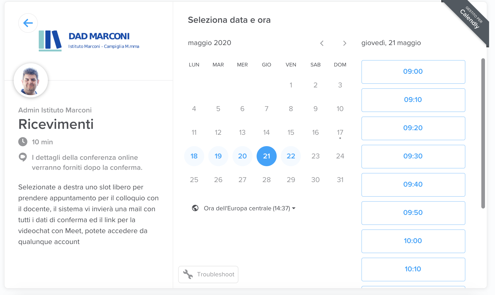

Per prenotare un colloquio con il docente cliccare su PRENOTA vicino al nome del docente interessato e scegliere il giorno e l'orario tra quelli disponibili. 

Per la prenotazione si deve inserire il proprio nome, un indirizzo mail, il nome e la classe dell'alunno.  

Come conferma della prenotazione riceverete una mail all'indirizzo che avete inserito, mail che contiene tutti i riferimenti ed il link a Meet da utilizzare per il colloquio con quel docente 

Per ogni docente e quindi per ogni materia dovrete effettuare una prenotazione ricevendo la relativa conferma tramite mail, tenete conto quindi di prenotare i colloqui non tutti nello stesso orario ma scadenzati l'uno dall'altro in modo da potervi partecipare senza sovrapposizioni. 

**Esempio:** 

Italiano prenotato alle 14:30 
Matematica prenotata alle 14:50 
 
All'interno di ogni mail che riceverete avete il riepilogo dell'appuntamento con il nome del docente, l'orario fissato ed il link diretto al Meet per parlare con il docente. 

**Il giorno fissato per i ricevimenti dovrete aprire una ad una le mail delle prenotazioni e collegarvi al Meet con il docente all'orario fissato. Il Meet funziona con qualsiasi email anche vostra privata non è obbligatorio utilizzare quella dell'alunno**
 

| Nome Docente       	| Link di prenotazione                    	|
|--------------------	|-----------------------------------------	|
| Agnese Fossi       	| [Prenota](https://calendly.com/fossi-agnese)     	|
| Angiolo Fedeli     	| [Prenota](https://calendly.com/fedeli-angiolo) 	|
| Debora Maccanti    	| [Prenota](https://calendly.com/maccanti-debora) 	|
| Fiorenza Rafanelli 	| [Prenota](https://calendly.com/rafanelli-fiorenza)|
| Francesca Manenti  	| [Prenota](https://calendly.com/manenti-francesca) |
| Bernardini Egizia     | [Prenota](https://calendly.com/bernardini-egizia) |
| Sforzi Damiana        | [Prenota](https://calendly.com/sforzi-damiana)    |
| Merlo Roberto         | [Prenota](https://calendly.com/merlo-roberto )    |
| Pomponi Mariastella   | [Prenota](https://calendly.com/pomponi-mariastella )    |
| Ulivi Maria Stella   | [Prenota](https://calendly.com/ulivi-mariastella )    |
| Trassinelli Marisa  | [Prenota](https://calendly.com/trassinelli-marisa )    |
| Ciardini Cristina   | [Prenota](https://calendly.com/ciardini-cristina)    |
| Gennari Benedetta   | [Prenota](https://calendly.com/gennari-benedetta )    |
| Gennari Benedetta   | [Prenota](https://calendly.com/gennari-benedetta )    |
| Princi Sibilla   | [Prenota](https://calendly.com/princi-sibilla )    |
| Stecca Valeria   | [Prenota](https://calendly.com/stecca-valeria )    |
| Ricci Luciano  | [Prenota](https://calendly.com/ricci-luciano)    |
| Corallo Salvatore | [Prenota](https://calendly.com/corallo-salvatore)    |
| Marroni Silvia | [Prenota](https://calendly.com/marroni-silvia)    |
| Mai Daria| [Prenota](https://calendly.com/mai-daria)    |

 

